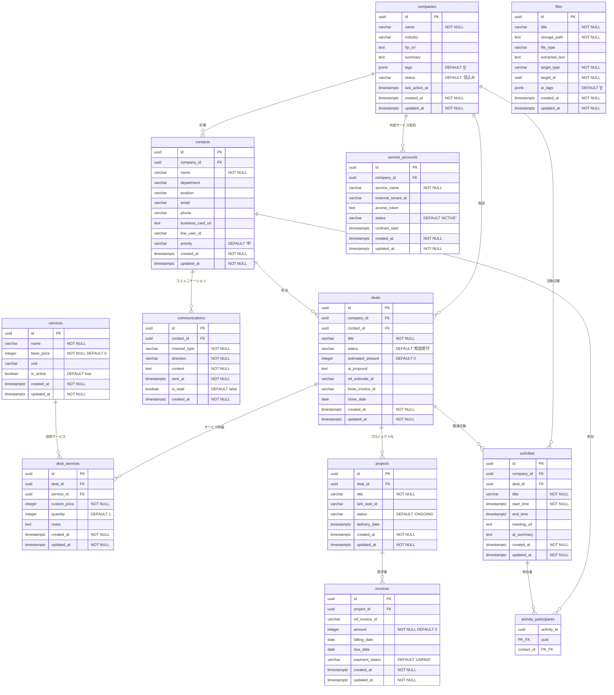

# EIS 顧客管理システム - データベース仕様書

## 概要

EIS（Enterprise Information System）顧客管理システムのデータベース仕様書。
Supabase（PostgreSQL）上に構築され、CRM機能・商談管理・外部サービス連携を実現する。

---

## ER図

---

## テーブル定義

### 1. companies（企業）

CRM管理対象の企業情報を格納するコアテーブル。

| カラム名 | 型 | 制約 | デフォルト値 | 説明 |
|---|---|---|---|---|
| `id` | `UUID` | PRIMARY KEY | `uuid_generate_v4()` | 企業ID |
| `name` | `VARCHAR(255)` | NOT NULL | - | 企業名 |
| `industry` | `VARCHAR(100)` | - | - | 業種 |
| `hp_url` | `TEXT` | - | - | ホームページURL |
| `summary` | `TEXT` | - | - | 企業概要 |
| `tags` | `JSONB` | - | `'[]'::jsonb` | タグ（JSON配列） |
| `status` | `VARCHAR(50)` | - | `'見込み'` | ステータス |
| `last_active_at` | `TIMESTAMP WITH TIME ZONE` | - | - | 最終活動日時 |
| `created_at` | `TIMESTAMP WITH TIME ZONE` | NOT NULL | `timezone('utc', now())` | 作成日時 |
| `updated_at` | `TIMESTAMP WITH TIME ZONE` | NOT NULL | `timezone('utc', now())` | 更新日時 |

---

### 2. contacts（連絡先）

企業に所属する担当者情報。

| カラム名 | 型 | 制約 | デフォルト値 | 説明 |
|---|---|---|---|---|
| `id` | `UUID` | PRIMARY KEY | `uuid_generate_v4()` | 連絡先ID |
| `company_id` | `UUID` | FK → `companies(id)` ON DELETE CASCADE | - | 所属企業ID |
| `name` | `VARCHAR(255)` | NOT NULL | - | 氏名 |
| `department` | `VARCHAR(255)` | - | - | 部署 |
| `position` | `VARCHAR(255)` | - | - | 役職 |
| `email` | `VARCHAR(255)` | - | - | メールアドレス |
| `phone` | `VARCHAR(50)` | - | - | 電話番号 |
| `business_card_url` | `TEXT` | - | - | 名刺画像URL |
| `line_user_id` | `VARCHAR(100)` | - | - | LINE ユーザーID |
| `priority` | `VARCHAR(20)` | - | `'中'` | 優先度（高/中/低） |
| `created_at` | `TIMESTAMP WITH TIME ZONE` | NOT NULL | `timezone('utc', now())` | 作成日時 |
| `updated_at` | `TIMESTAMP WITH TIME ZONE` | NOT NULL | `timezone('utc', now())` | 更新日時 |

---

### 3. services（サービス）

提供サービスのマスタ情報。

| カラム名 | 型 | 制約 | デフォルト値 | 説明 |
|---|---|---|---|---|
| `id` | `UUID` | PRIMARY KEY | `uuid_generate_v4()` | サービスID |
| `name` | `VARCHAR(255)` | NOT NULL | - | サービス名 |
| `base_price` | `INTEGER` | NOT NULL | `0` | 基本価格（円） |
| `unit` | `VARCHAR(50)` | - | - | 単位（月額/一式/1回 等） |
| `is_active` | `BOOLEAN` | - | `true` | 有効フラグ |
| `created_at` | `TIMESTAMP WITH TIME ZONE` | NOT NULL | `timezone('utc', now())` | 作成日時 |
| `updated_at` | `TIMESTAMP WITH TIME ZONE` | NOT NULL | `timezone('utc', now())` | 更新日時 |

---

### 4. deals（商談）

商談情報を管理するテーブル。freee連携のキーとなる `freee_invoice_id` を保持。

| カラム名 | 型 | 制約 | デフォルト値 | 説明 |
|---|---|---|---|---|
| `id` | `UUID` | PRIMARY KEY | `uuid_generate_v4()` | 商談ID |
| `company_id` | `UUID` | FK → `companies(id)` ON DELETE CASCADE | - | 対象企業ID |
| `contact_id` | `UUID` | FK → `contacts(id)` ON DELETE SET NULL | - | 担当連絡先ID |
| `title` | `VARCHAR(255)` | NOT NULL | - | 商談タイトル |
| `status` | `VARCHAR(50)` | - | `'相談受付'` | ステータス |
| `estimated_amount` | `INTEGER` | - | `0` | 見積金額（円） |
| `ai_proposal` | `TEXT` | - | - | AI提案内容 |
| `mf_estimate_id` | `VARCHAR(100)` | - | - | MF見積ID（旧連携） |
| `freee_invoice_id` | `VARCHAR(255)` | - | - | freee請求書ID |
| `close_date` | `DATE` | - | - | クローズ予定日 |
| `created_at` | `TIMESTAMP WITH TIME ZONE` | NOT NULL | `timezone('utc', now())` | 作成日時 |
| `updated_at` | `TIMESTAMP WITH TIME ZONE` | NOT NULL | `timezone('utc', now())` | 更新日時 |

---

### 5. deal_services（商談サービス明細）

商談に紐づくサービス明細。1商談に複数サービスを設定可能。

| カラム名 | 型 | 制約 | デフォルト値 | 説明 |
|---|---|---|---|---|
| `id` | `UUID` | PRIMARY KEY | `uuid_generate_v4()` | 明細ID |
| `deal_id` | `UUID` | FK → `deals(id)` ON DELETE CASCADE | - | 商談ID |
| `service_id` | `UUID` | FK → `services(id)` ON DELETE CASCADE | - | サービスID |
| `custom_price` | `INTEGER` | NOT NULL | - | カスタム価格（円） |
| `quantity` | `INTEGER` | - | `1` | 数量 |
| `notes` | `TEXT` | - | - | 備考 |
| `created_at` | `TIMESTAMP WITH TIME ZONE` | NOT NULL | `timezone('utc', now())` | 作成日時 |
| `updated_at` | `TIMESTAMP WITH TIME ZONE` | NOT NULL | `timezone('utc', now())` | 更新日時 |

---

### 6. activities（活動記録）

企業との打ち合わせ・活動を記録するテーブル。

| カラム名 | 型 | 制約 | デフォルト値 | 説明 |
|---|---|---|---|---|
| `id` | `UUID` | PRIMARY KEY | `uuid_generate_v4()` | 活動ID |
| `company_id` | `UUID` | FK → `companies(id)` ON DELETE CASCADE | - | 対象企業ID |
| `deal_id` | `UUID` | FK → `deals(id)` ON DELETE SET NULL | - | 関連商談ID |
| `title` | `VARCHAR(255)` | NOT NULL | - | 活動タイトル |
| `start_time` | `TIMESTAMP WITH TIME ZONE` | NOT NULL | - | 開始日時 |
| `end_time` | `TIMESTAMP WITH TIME ZONE` | - | - | 終了日時 |
| `meeting_url` | `TEXT` | - | - | 会議URL |
| `ai_summary` | `TEXT` | - | - | AI議事録サマリ |
| `created_at` | `TIMESTAMP WITH TIME ZONE` | NOT NULL | `timezone('utc', now())` | 作成日時 |
| `updated_at` | `TIMESTAMP WITH TIME ZONE` | NOT NULL | `timezone('utc', now())` | 更新日時 |

---

### 7. activity_participants（活動参加者）

活動と連絡先の多対多中間テーブル。

| カラム名 | 型 | 制約 | デフォルト値 | 説明 |
|---|---|---|---|---|
| `activity_id` | `UUID` | PK, FK → `activities(id)` ON DELETE CASCADE | - | 活動ID |
| `contact_id` | `UUID` | PK, FK → `contacts(id)` ON DELETE CASCADE | - | 連絡先ID |

---

### 8. communications（コミュニケーション）

連絡先との通信記録。

| カラム名 | 型 | 制約 | デフォルト値 | 説明 |
|---|---|---|---|---|
| `id` | `UUID` | PRIMARY KEY | `uuid_generate_v4()` | 通信ID |
| `contact_id` | `UUID` | FK → `contacts(id)` ON DELETE CASCADE | - | 連絡先ID |
| `channel_type` | `VARCHAR(50)` | NOT NULL | - | チャネル種別（email/LINE/phone 等） |
| `direction` | `VARCHAR(50)` | NOT NULL | - | 方向（inbound/outbound） |
| `content` | `TEXT` | NOT NULL | - | 内容 |
| `sent_at` | `TIMESTAMP WITH TIME ZONE` | NOT NULL | - | 送信日時 |
| `is_read` | `BOOLEAN` | - | `false` | 既読フラグ |
| `created_at` | `TIMESTAMP WITH TIME ZONE` | NOT NULL | `timezone('utc', now())` | 作成日時 |

---

### 9. files（ファイル）

ポリモーフィック関連を使用した汎用ファイル管理テーブル。`target_type` と `target_id` で任意のテーブルに紐付け可能。

| カラム名 | 型 | 制約 | デフォルト値 | 説明 |
|---|---|---|---|---|
| `id` | `UUID` | PRIMARY KEY | `uuid_generate_v4()` | ファイルID |
| `title` | `VARCHAR(255)` | NOT NULL | - | ファイルタイトル |
| `storage_path` | `TEXT` | NOT NULL | - | ストレージパス |
| `file_type` | `VARCHAR(50)` | - | - | ファイル種別 |
| `extracted_text` | `TEXT` | - | - | OCR等で抽出したテキスト |
| `target_type` | `VARCHAR(50)` | NOT NULL | - | 紐付け先テーブル名 |
| `target_id` | `UUID` | NOT NULL | - | 紐付け先レコードID |
| `ai_tags` | `JSONB` | - | `'[]'::jsonb` | AIが付与したタグ |
| `created_at` | `TIMESTAMP WITH TIME ZONE` | NOT NULL | `timezone('utc', now())` | 作成日時 |
| `updated_at` | `TIMESTAMP WITH TIME ZONE` | NOT NULL | `timezone('utc', now())` | 更新日時 |

---

### 10. service_accounts（サービスアカウント）

企業が利用する外部サービスの契約情報。

| カラム名 | 型 | 制約 | デフォルト値 | 説明 |
|---|---|---|---|---|
| `id` | `UUID` | PRIMARY KEY | `uuid_generate_v4()` | アカウントID |
| `company_id` | `UUID` | FK → `companies(id)` ON DELETE CASCADE | - | 企業ID |
| `service_name` | `VARCHAR(100)` | NOT NULL | - | サービス名 |
| `external_tenant_id` | `VARCHAR(255)` | - | - | 外部テナントID |
| `access_token` | `TEXT` | - | - | アクセストークン |
| `status` | `VARCHAR(50)` | - | `'ACTIVE'` | ステータス |
| `contract_start` | `TIMESTAMP WITH TIME ZONE` | - | - | 契約開始日 |
| `created_at` | `TIMESTAMP WITH TIME ZONE` | NOT NULL | `timezone('utc', now())` | 作成日時 |
| `updated_at` | `TIMESTAMP WITH TIME ZONE` | NOT NULL | `timezone('utc', now())` | 更新日時 |

---

### 11. projects（プロジェクト）

商談から発展したプロジェクトの進行管理。

| カラム名 | 型 | 制約 | デフォルト値 | 説明 |
|---|---|---|---|---|
| `id` | `UUID` | PRIMARY KEY | `uuid_generate_v4()` | プロジェクトID |
| `deal_id` | `UUID` | FK → `deals(id)` ON DELETE SET NULL | - | 元商談ID |
| `title` | `VARCHAR(255)` | NOT NULL | - | プロジェクト名 |
| `lark_task_id` | `VARCHAR(255)` | - | - | Larkタスク連携ID |
| `status` | `VARCHAR(50)` | - | `'ONGOING'` | ステータス |
| `delivery_date` | `TIMESTAMP WITH TIME ZONE` | - | - | 納品予定日 |
| `created_at` | `TIMESTAMP WITH TIME ZONE` | NOT NULL | `timezone('utc', now())` | 作成日時 |
| `updated_at` | `TIMESTAMP WITH TIME ZONE` | NOT NULL | `timezone('utc', now())` | 更新日時 |

---

### 12. invoices（請求書）

プロジェクトに対する請求書情報。

| カラム名 | 型 | 制約 | デフォルト値 | 説明 |
|---|---|---|---|---|
| `id` | `UUID` | PRIMARY KEY | `uuid_generate_v4()` | 請求書ID |
| `project_id` | `UUID` | FK → `projects(id)` ON DELETE CASCADE | - | プロジェクトID |
| `mf_invoice_id` | `VARCHAR(255)` | - | - | MF請求書ID（旧連携） |
| `amount` | `INTEGER` | NOT NULL | `0` | 請求金額（円） |
| `billing_date` | `DATE` | - | - | 請求日 |
| `due_date` | `DATE` | - | - | 支払期日 |
| `payment_status` | `VARCHAR(50)` | - | `'UNPAID'` | 支払ステータス |
| `created_at` | `TIMESTAMP WITH TIME ZONE` | NOT NULL | `timezone('utc', now())` | 作成日時 |
| `updated_at` | `TIMESTAMP WITH TIME ZONE` | NOT NULL | `timezone('utc', now())` | 更新日時 |

---

## インデックス一覧

| インデックス名 | テーブル | カラム | 条件 | 用途 |
|---|---|---|---|---|
| `idx_contacts_email_unique` | `contacts` | `email` | `WHERE email IS NOT NULL AND email != ''` | メールアドレスの部分ユニーク制約（NULL・空文字列を除外） |
| `idx_files_target` | `files` | `target_type, target_id` | - | ポリモーフィック関連の検索高速化 |
| `idx_companies_name` | `companies` | `name` | - | 企業名検索の高速化 |
| `idx_companies_status` | `companies` | `status` | - | ステータスフィルタの高速化 |
| `idx_contacts_company_id` | `contacts` | `company_id` | - | 企業別連絡先取得の高速化 |
| `idx_contacts_name` | `contacts` | `name` | - | 連絡先名検索の高速化 |
| `idx_deals_company_id` | `deals` | `company_id` | - | 企業別商談取得の高速化 |
| `idx_deals_contact_id` | `deals` | `contact_id` | - | 連絡先別商談取得の高速化 |
| `idx_deals_status` | `deals` | `status` | - | ステータスフィルタの高速化 |
| `idx_deals_freee_invoice_id` | `deals` | `freee_invoice_id` | - | freee連携時の重複チェック高速化 |

---

## RLSポリシー一覧

全テーブルで Row Level Security (RLS) が有効化されている。
現在は全ポリシーが `authenticated` ロールに対して全操作を許可する設定（`USING (true)` / `WITH CHECK (true)`）。

### CRMコアテーブル

| テーブル | ポリシー名 | 操作 | 対象ロール | 条件 |
|---|---|---|---|---|
| `companies` | `companies_select` | SELECT | `authenticated` | `USING (true)` |
| `companies` | `companies_insert` | INSERT | `authenticated` | `WITH CHECK (true)` |
| `companies` | `companies_update` | UPDATE | `authenticated` | `USING (true)` |
| `companies` | `companies_delete` | DELETE | `authenticated` | `USING (true)` |
| `contacts` | `contacts_select` | SELECT | `authenticated` | `USING (true)` |
| `contacts` | `contacts_insert` | INSERT | `authenticated` | `WITH CHECK (true)` |
| `contacts` | `contacts_update` | UPDATE | `authenticated` | `USING (true)` |
| `contacts` | `contacts_delete` | DELETE | `authenticated` | `USING (true)` |
| `services` | `services_select` | SELECT | `authenticated` | `USING (true)` |
| `services` | `services_insert` | INSERT | `authenticated` | `WITH CHECK (true)` |
| `services` | `services_update` | UPDATE | `authenticated` | `USING (true)` |
| `deals` | `deals_select` | SELECT | `authenticated` | `USING (true)` |
| `deals` | `deals_insert` | INSERT | `authenticated` | `WITH CHECK (true)` |
| `deals` | `deals_update` | UPDATE | `authenticated` | `USING (true)` |
| `deals` | `deals_delete` | DELETE | `authenticated` | `USING (true)` |
| `deal_services` | `deal_services_select` | SELECT | `authenticated` | `USING (true)` |
| `deal_services` | `deal_services_insert` | INSERT | `authenticated` | `WITH CHECK (true)` |
| `deal_services` | `deal_services_update` | UPDATE | `authenticated` | `USING (true)` |

### トラッキング・連携テーブル

| テーブル | ポリシー名 | 操作 | 対象ロール | 条件 |
|---|---|---|---|---|
| `activities` | `activities_all` | ALL | `authenticated` | `USING (true)` / `WITH CHECK (true)` |
| `activity_participants` | `activity_participants_all` | ALL | `authenticated` | `USING (true)` / `WITH CHECK (true)` |
| `communications` | `communications_all` | ALL | `authenticated` | `USING (true)` / `WITH CHECK (true)` |
| `files` | `files_all` | ALL | `authenticated` | `USING (true)` / `WITH CHECK (true)` |
| `service_accounts` | `service_accounts_all` | ALL | `authenticated` | `USING (true)` / `WITH CHECK (true)` |
| `projects` | `projects_all` | ALL | `authenticated` | `USING (true)` / `WITH CHECK (true)` |
| `invoices` | `invoices_all` | ALL | `authenticated` | `USING (true)` / `WITH CHECK (true)` |

> **注意**: 現在のRLSポリシーは認証済みユーザーに全操作を許可する開発用設定です。本番運用では、ユーザーごとのアクセス制御（マルチテナント対応等）を検討してください。

---

## シードデータ

テスト用に以下のサービスが初期投入される。

| ID | サービス名 | 基本価格 | 単位 |
|---|---|---|---|
| `11111111-...` | Ehime Base 法人プラン | 50,000円 | 月額 |
| `22222222-...` | リクルートサイト動画制作 | 300,000円 | 一式 |
| `33333333-...` | 魅力発見セッション | 100,000円 | 1回 |
