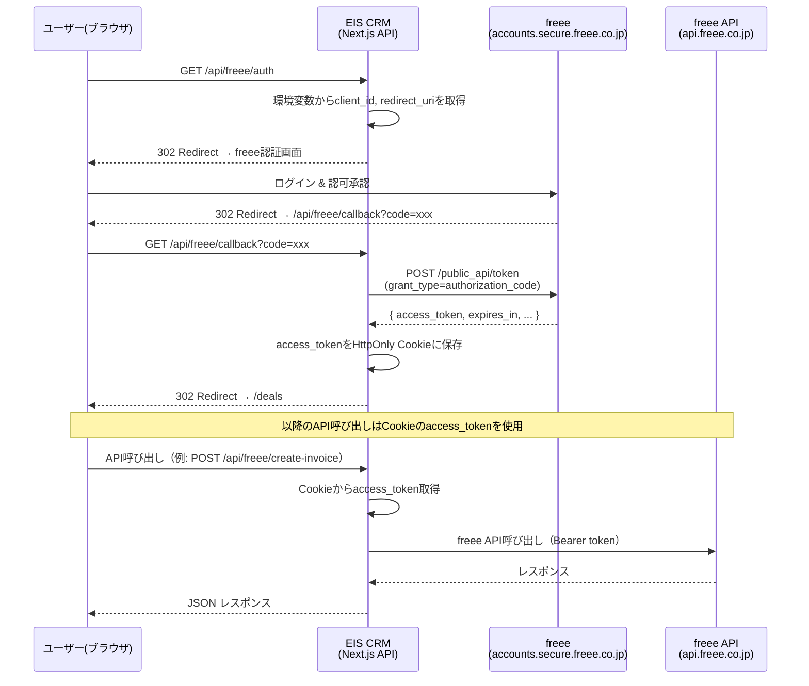
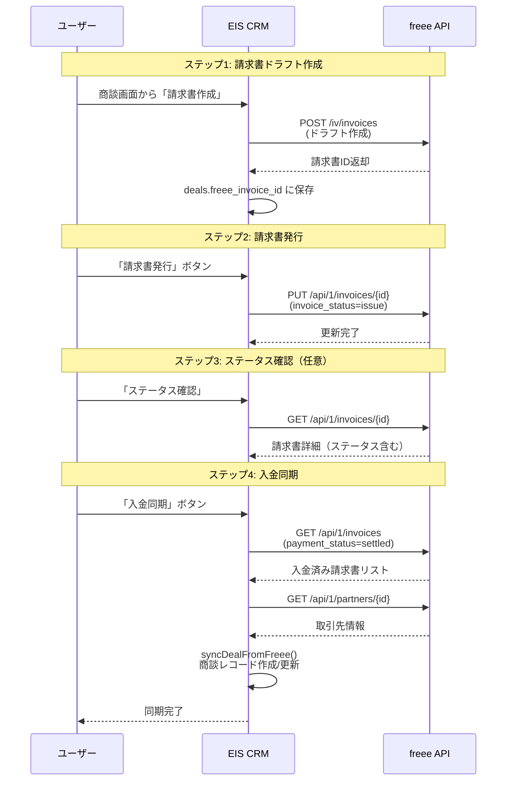

# EIS 顧客管理システム - freee連携仕様書

## 概要

EIS CRMシステムとfreee会計を連携し、請求書・見積書の作成、発行、入金確認、入出金明細の取得を実現する。
OAuth 2.0 認証により freee API へのアクセスを行い、CRM上の商談データと freee の請求書データを双方向に同期する。

---

## 環境変数

| 変数名 | 説明 |
|---|---|
| `FREEE_CLIENT_ID` | freeeアプリのクライアントID |
| `FREEE_CLIENT_SECRET` | freeeアプリのクライアントシークレット |
| `FREEE_REDIRECT_URI` | OAuth認証後のコールバックURL |

---

## OAuth認証フロー

### シーケンス図



### 認証の詳細

1. **認証開始** (`GET /api/freee/auth`)
   - `FREEE_CLIENT_ID` と `FREEE_REDIRECT_URI` を使用して freee の認証URLを構築
   - ユーザーを `https://accounts.secure.freee.co.jp/public_api/authorize` にリダイレクト

2. **コールバック処理** (`GET /api/freee/callback`)
   - freeeから認可コード(`code`)を受信
   - 認可コードを使用してアクセストークンをPOSTで取得
   - 取得したアクセストークンを `freee_access_token` としてHttpOnly Cookieに保存
   - Cookie の `maxAge` はトークンの `expires_in` に準拠
   - 認証完了後、`/deals` ページにリダイレクト

### トークン管理

| 項目 | 値 |
|---|---|
| トークン保存先 | HttpOnly Cookie (`freee_access_token`) |
| Cookie パス | `/` |
| 有効期限 | freeeの `expires_in` に準拠 |
| リフレッシュトークン | 現在は未保存（簡易実装） |

> **注意**: 現在の実装ではリフレッシュトークンを保存していないため、アクセストークンの期限が切れた場合は再認証が必要です。

---

## APIエンドポイント仕様

### 1. `GET /api/freee/auth` - 認証開始

freee OAuth認証画面へのリダイレクトを行う。

#### リクエスト

パラメータなし。

#### レスポンス

| ステータス | 説明 |
|---|---|
| `302` | freee認証画面へリダイレクト |
| `500` | 環境変数（`FREEE_CLIENT_ID` / `FREEE_REDIRECT_URI`）が未設定 |

#### エラーレスポンス例

```json
{
  "error": "Missing Freee credentials"
}
```

---

### 2. `GET /api/freee/callback` - OAuth コールバック

freeeからの認可コードを受信し、アクセストークンを取得・保存する。

#### リクエスト

| パラメータ | 型 | 必須 | 説明 |
|---|---|---|---|
| `code` | `string` | はい | freeeから付与される認可コード |
| `error` | `string` | いいえ | 認証エラー時のエラーコード |

#### レスポンス

| ステータス | 説明 |
|---|---|
| `302` | 認証成功 → `/deals` へリダイレクト（Cookieにトークン設定） |
| `400` | 認可コードなし / 認証失敗 |
| `500` | 内部サーバーエラー |

#### エラーレスポンス例

```json
{
  "error": "No authorization code provided"
}
```

```json
{
  "error": "Authorization failed",
  "details": "access_denied"
}
```

---

### 3. `POST /api/freee/create-invoice` - 請求書作成

freee上に請求書のドラフトを作成する。取引先が存在しない場合は自動作成する。

#### リクエスト

**Headers**: Cookie に `freee_access_token` が必要

**Body (JSON)**:

| パラメータ | 型 | 必須 | デフォルト値 | 説明 |
|---|---|---|---|---|
| `title` | `string` | いいえ | `'CRMからの請求書'` | 請求書タイトル |
| `amount` | `number` | いいえ | `0` | 単価（円） |
| `description` | `string` | いいえ | `'システム開発費'` | 明細の説明 |
| `issue_date` | `string` | いいえ | 当日 | 発行日（YYYY-MM-DD） |
| `billing_date` | `string` | いいえ | 当日 | 売上計上日（YYYY-MM-DD） |
| `due_date` | `string` | いいえ | 翌月末 | 支払期日（YYYY-MM-DD） |
| `quantity` | `number` | いいえ | `1` | 数量 |
| `unit` | `string` | いいえ | `'式'` | 単位 |
| `note` | `string` | いいえ | `''` | 備考 |
| `company_name` | `string` | いいえ | `'テスト受託会社(CRM自動生成)'` | 取引先名 |

#### 内部処理フロー

1. Cookieからアクセストークン取得
2. freee事業所一覧API → 最初の事業所IDを取得
3. 取引先検索（`company_name` でキーワード検索）
   - 見つかった場合: 既存の `partner_id` を使用
   - 見つからない場合: 新規取引先を自動作成
4. freee請求書API (`POST /iv/invoices`) でドラフト作成

#### freeeに送信される請求書データ

```json
{
  "company_id": "<事業所ID>",
  "partner_id": "<取引先ID>",
  "title": "CRMからの請求書",
  "issue_date": "2026-03-07",
  "billing_date": "2026-03-07",
  "due_date": "2026-04-30",
  "partner_title": "御中",
  "tax_entry_method": "out",
  "tax_fraction": "omit",
  "withholding_tax_entry_method": "out",
  "lines": [
    {
      "type": "item",
      "quantity": 1,
      "unit": "式",
      "unit_price": "100000",
      "description": "システム開発費",
      "tax_rate": 10
    }
  ]
}
```

#### レスポンス

| ステータス | 説明 |
|---|---|
| `200` | 請求書ドラフト作成成功 |
| `401` | 未認証（Cookie にトークンなし） |
| `400` | 取引先作成失敗 |
| `404` | freee事業所が見つからない |
| `4xx` | freee APIエラー（詳細はdetailsに含まれる） |
| `500` | 内部サーバーエラー |

#### 成功レスポンス例

```json
{
  "success": true,
  "message": "請求書のドラフトがfreeeに作成されました！",
  "data": { ... }
}
```

---

### 4. `POST /api/freee/create-quotation` - 見積書作成

freee上に見積書のドラフトを作成する。

#### リクエスト

**Headers**: Cookie に `freee_access_token` が必要

**Body (JSON)**:

| パラメータ | 型 | 必須 | デフォルト値 | 説明 |
|---|---|---|---|---|
| `title` | `string` | いいえ | `'CRMからのテスト見積書'` | 見積書タイトル |
| `amount` | `number` | いいえ | `100000` | 単価（円） |

#### 内部処理フロー

1. Cookieからアクセストークン取得
2. freee事業所一覧API → 最初の事業所IDを取得
3. 取引先を1件取得（存在しない場合は自動作成）
4. freee見積書API (`POST /iv/quotations`) でドラフト作成

#### レスポンス

| ステータス | 説明 |
|---|---|
| `200` | 見積書ドラフト作成成功 |
| `401` | 未認証 |
| `400` | 取引先作成失敗 / freee APIエラー |
| `404` | freee事業所が見つからない |
| `500` | 内部サーバーエラー |

#### 成功レスポンス例

```json
{
  "success": true,
  "message": "見積書のドラフトがfreeeに作成されました！",
  "data": { ... }
}
```

---

### 5. `GET /api/freee/invoice-status` - 請求書ステータス取得

freee上の請求書の詳細情報とステータスを取得する。

#### リクエスト

**Headers**: Cookie に `freee_access_token` が必要

**Query Parameters**:

| パラメータ | 型 | 必須 | 説明 |
|---|---|---|---|
| `id` | `string` | はい | freee請求書ID |

#### 内部処理フロー

1. Cookieからアクセストークン取得
2. freee事業所一覧API → 最初の事業所IDを取得
3. freee請求書詳細API (`GET /api/1/invoices/{id}`) で情報取得
4. 404の場合は `is_deleted: true` として返却

#### レスポンス

| ステータス | 説明 |
|---|---|
| `200` | 請求書情報取得成功 |
| `200` | 請求書が削除済み（`is_deleted: true`） |
| `400` | 請求書IDが未指定 |
| `401` | 未認証 |
| `404` | freee事業所が見つからない |
| `500` | 内部サーバーエラー |

#### 成功レスポンス例

```json
{
  "success": true,
  "data": {
    "id": 12345,
    "title": "CRMからの請求書",
    "invoice_status": "draft",
    "total_amount": 110000,
    ...
  }
}
```

#### 削除済みレスポンス例

```json
{
  "success": true,
  "is_deleted": true
}
```

---

### 6. `POST /api/freee/issue-invoice` - 請求書発行

freee上の請求書ステータスを「発行済み」に変更する。

#### リクエスト

**Headers**: Cookie に `freee_access_token` が必要

**Body (JSON)**:

| パラメータ | 型 | 必須 | 説明 |
|---|---|---|---|
| `invoice_id` | `string` | はい | freee請求書ID |

#### 内部処理フロー

1. Cookieからアクセストークン取得
2. freee事業所一覧API → 最初の事業所IDを取得
3. freee請求書更新API (`PUT /api/1/invoices/{id}`) で `invoice_status` を `'issue'` に更新
4. 既に発行済みの場合はエラーを無視して成功として返却

#### レスポンス

| ステータス | 説明 |
|---|---|
| `200` | 発行成功 |
| `200` | 既に発行済み（エラー無視） |
| `400` | `invoice_id` が未指定 |
| `401` | 未認証 |
| `404` | freee事業所が見つからない |
| `4xx` | freee APIエラー |
| `500` | 内部サーバーエラー |

#### 成功レスポンス例

```json
{
  "success": true,
  "message": "請求書を発行(送付)済みに変更しました！",
  "data": { ... }
}
```

---

### 7. `GET /api/freee/partner-documents` - 取引先書類一覧取得

指定した取引先名に紐づく請求書・見積書の一覧を取得する。

#### リクエスト

**Headers**: Cookie に `freee_access_token` が必要

**Query Parameters**:

| パラメータ | 型 | 必須 | 説明 |
|---|---|---|---|
| `company_name` | `string` | はい | 取引先名（freee上の企業名） |

#### 内部処理フロー

1. Cookieからアクセストークン取得
2. freee事業所一覧API → 最初の事業所IDを取得
3. 取引先検索（`company_name` でキーワード検索）
   - 見つからない場合: 空の結果を返却
4. 該当取引先の請求書一覧 (`GET /api/1/invoices`) を取得
5. 該当取引先の見積書一覧 (`GET /api/1/quotations`) を取得

#### レスポンス

| ステータス | 説明 |
|---|---|
| `200` | 書類一覧取得成功 |
| `400` | `company_name` が未指定 |
| `401` | 未認証 |
| `404` | freee事業所が見つからない |
| `500` | 内部サーバーエラー |

#### 成功レスポンス例

```json
{
  "success": true,
  "data": {
    "invoices": [
      { "id": 12345, "title": "請求書A", "total_amount": 110000, ... }
    ],
    "quotations": [
      { "id": 67890, "title": "見積書B", "total_amount": 55000, ... }
    ]
  }
}
```

---

### 8. `POST /api/freee/sync-latest-paid` - 入金済み請求書同期

freee上の最新の入金済み請求書を取得し、CRMの商談データとして同期する。

#### リクエスト

**Headers**: Cookie に `freee_access_token` が必要

**Body**: なし（空のPOSTリクエスト）

#### 内部処理フロー

1. Cookieからアクセストークン取得
2. freee事業所一覧API → 最初の事業所IDを取得
3. 入金済み請求書を1件取得 (`GET /api/1/invoices?payment_status=settled&limit=1`)
4. 取引先詳細API (`GET /api/1/partners/{id}`) で取引先名を取得
5. `syncDealFromFreee()` 関数でCRMに同期:
   - `freee_invoice_id` で重複チェック
   - CRM上の企業名と照合（存在しない場合は企業を新規作成）
   - 商談レコードを作成（ステータス: `'入金確認完了'`）

#### syncDealFromFreee 関数の詳細

| 処理 | 説明 |
|---|---|
| 重複チェック | `deals.freee_invoice_id` で既存レコードを検索 |
| 企業解決 | `companies.name` で検索 → 見つからなければ新規作成（ステータス: `'成約'`） |
| 商談作成 | タイトル・金額・日付・freee請求書IDをマッピングして挿入 |
| キャッシュ更新 | `revalidatePath('/deals')` で商談一覧を再検証 |

#### レスポンス

| ステータス | 説明 |
|---|---|
| `200` | 同期成功 |
| `200` | 入金済み請求書なし（`success: false`） |
| `200` | 既に連携済み（`isDuplicate: true`） |
| `401` | 未認証 |
| `404` | freee事業所が見つからない |
| `4xx` | freee APIエラー |
| `500` | 内部サーバーエラー |

#### 成功レスポンス例

```json
{
  "success": true,
  "message": "最新の入金済み請求書から商談データを連携・作成しました！",
  "dealId": "uuid-xxx-xxx"
}
```

#### 重複レスポンス例

```json
{
  "success": false,
  "message": "すでに連携済みの商談です",
  "isDuplicate": true,
  "dealId": "uuid-xxx-xxx"
}
```

---

### 9. `GET /api/freee/wallet-txns` - 入出金明細取得

freee上の入金明細（直近5件）を取得する。

#### リクエスト

**Headers**: Cookie に `freee_access_token` が必要

パラメータなし。

#### 内部処理フロー

1. Cookieからアクセストークン取得
2. freee事業所一覧API → 最初の事業所IDを取得
3. 入出金明細API (`GET /api/1/wallet_txns?entry_side=income&limit=5`) を呼び出し

#### レスポンス

| ステータス | 説明 |
|---|---|
| `200` | 明細取得成功 |
| `401` | 未認証 |
| `404` | freee事業所が見つからない |
| `4xx` | freee APIエラー |
| `500` | 内部サーバーエラー |

#### 成功レスポンス例

```json
{
  "success": true,
  "data": [
    {
      "id": 1,
      "date": "2026-03-01",
      "entry_side": "income",
      "amount": 100000,
      "description": "振込入金",
      ...
    }
  ]
}
```

---

## 請求書ライフサイクル（作成 → 発行 → 入金同期）

### フロー図



### 状態遷移

```
[CRM商談] → 請求書作成 → [freeeドラフト] → 発行 → [freee発行済] → 入金 → [freee入金済]
                                                                              ↓
                                                                     入金同期 → [CRM: 入金確認完了]
```

### 各ステップの詳細

| ステップ | APIエンドポイント | freee API | 説明 |
|---|---|---|---|
| 1. 請求書作成 | `POST /api/freee/create-invoice` | `POST /iv/invoices` | 商談情報からfreeeに請求書ドラフトを作成 |
| 2. 請求書発行 | `POST /api/freee/issue-invoice` | `PUT /api/1/invoices/{id}` | ドラフトを「発行済み」ステータスに変更 |
| 3. ステータス確認 | `GET /api/freee/invoice-status` | `GET /api/1/invoices/{id}` | 請求書の最新ステータスを確認 |
| 4. 入金同期 | `POST /api/freee/sync-latest-paid` | `GET /api/1/invoices` + `GET /api/1/partners/{id}` | 入金済み請求書をCRM商談に同期 |

---

## 使用するfreee API一覧

| freee APIエンドポイント | メソッド | 用途 | 使用箇所 |
|---|---|---|---|
| `https://accounts.secure.freee.co.jp/public_api/authorize` | GET | OAuth認証画面 | auth |
| `https://accounts.secure.freee.co.jp/public_api/token` | POST | アクセストークン取得 | callback |
| `https://api.freee.co.jp/api/1/companies` | GET | 事業所一覧取得 | 全エンドポイント |
| `https://api.freee.co.jp/api/1/partners` | GET | 取引先検索 | create-invoice, create-quotation, partner-documents, sync-latest-paid |
| `https://api.freee.co.jp/api/1/partners` | POST | 取引先作成 | create-invoice, create-quotation |
| `https://api.freee.co.jp/api/1/partners/{id}` | GET | 取引先詳細取得 | sync-latest-paid |
| `https://api.freee.co.jp/iv/invoices` | POST | 請求書作成 | create-invoice |
| `https://api.freee.co.jp/iv/quotations` | POST | 見積書作成 | create-quotation |
| `https://api.freee.co.jp/api/1/invoices/{id}` | GET | 請求書詳細取得 | invoice-status |
| `https://api.freee.co.jp/api/1/invoices/{id}` | PUT | 請求書ステータス更新 | issue-invoice |
| `https://api.freee.co.jp/api/1/invoices` | GET | 請求書一覧取得 | partner-documents, sync-latest-paid |
| `https://api.freee.co.jp/api/1/quotations` | GET | 見積書一覧取得 | partner-documents |
| `https://api.freee.co.jp/api/1/wallet_txns` | GET | 入出金明細取得 | wallet-txns |

---

## エラーハンドリング

### 共通エラーパターン

全エンドポイントに共通するエラーハンドリングパターン。

#### 1. 認証エラー（401）

```json
{
  "error": "Not authenticated with freee"
}
```

**発生条件**: Cookie に `freee_access_token` が存在しない / 有効期限切れ

**対処方法**: `/api/freee/auth` から再認証を実行

#### 2. 事業所未検出（404）

```json
{
  "error": "No company found in freee"
}
```

**発生条件**: freeeアカウントに事業所が存在しない

**対処方法**: freee管理画面で事業所を作成

#### 3. freee APIエラー（4xx）

```json
{
  "error": "Failed to create invoice",
  "details": {
    "status_code": 422,
    "errors": [...]
  }
}
```

**発生条件**: freee APIのバリデーションエラー等

**対処方法**: `details` フィールドの内容を確認して入力データを修正

#### 4. 内部サーバーエラー（500）

```json
{
  "error": "Internal server error"
}
```

**発生条件**: 予期しない例外が発生（ネットワークエラー、JSON解析エラー等）

**対処方法**: サーバーログを確認

### エンドポイント固有のエラーハンドリング

| エンドポイント | 固有の処理 |
|---|---|
| `callback` | freee認証画面から `error` パラメータが返された場合、400エラーとして処理 |
| `create-invoice` | 取引先が見つからない場合、`company_name` で自動作成を試みる |
| `create-quotation` | 取引先が0件の場合、テスト用取引先を自動作成 |
| `invoice-status` | freee APIから404が返った場合、削除済み（`is_deleted: true`）として返却 |
| `issue-invoice` | 既に発行済みのステータスエラーは無視して成功として返却 |
| `partner-documents` | 取引先が見つからない場合、空の結果（`invoices: [], quotations: []`）を返却 |
| `sync-latest-paid` | 入金済み請求書が0件の場合、`success: false` + メッセージを返却 / 重複連携は `isDuplicate: true` で通知 |

---

## CRMとfreeeのデータマッピング

### 商談（deals）→ 請求書

| CRM（deals）フィールド | freee 請求書フィールド | 説明 |
|---|---|---|
| `title` | `title` | 請求書タイトル |
| `estimated_amount` | `lines[].unit_price` | 明細の単価 |
| `freee_invoice_id` | `id` | freee請求書のIDを保存 |
| 企業名（companies.name） | `partner_id` | 取引先の名前で検索して紐付け |

### freee請求書 → 商談（入金同期時）

| freee 請求書フィールド | CRM（deals）フィールド | 説明 |
|---|---|---|
| `id` | `freee_invoice_id` | 重複チェック用に保存 |
| `title` | `title` | 商談タイトル（空の場合は自動生成） |
| `total_amount` | `estimated_amount` | 見積金額として保存 |
| `issue_date` | `close_date` | クローズ日として保存 |
| 取引先名 | `company_id` | 企業名で検索 → 紐付け or 新規作成 |
| - | `status` | `'入金確認完了'` 固定 |

---

## ソースファイル一覧

| ファイルパス | 説明 |
|---|---|
| `src/app/api/freee/auth/route.ts` | OAuth認証開始 |
| `src/app/api/freee/callback/route.ts` | OAuthコールバック処理 |
| `src/app/api/freee/create-invoice/route.ts` | 請求書ドラフト作成 |
| `src/app/api/freee/create-quotation/route.ts` | 見積書ドラフト作成 |
| `src/app/api/freee/invoice-status/route.ts` | 請求書ステータス取得 |
| `src/app/api/freee/issue-invoice/route.ts` | 請求書発行（ステータス更新） |
| `src/app/api/freee/partner-documents/route.ts` | 取引先書類一覧取得 |
| `src/app/api/freee/sync-latest-paid/route.ts` | 入金済み請求書のCRM同期 |
| `src/app/api/freee/wallet-txns/route.ts` | 入出金明細取得 |
| `src/app/actions/deals.ts` | `syncDealFromFreee()` - CRM同期ロジック |
